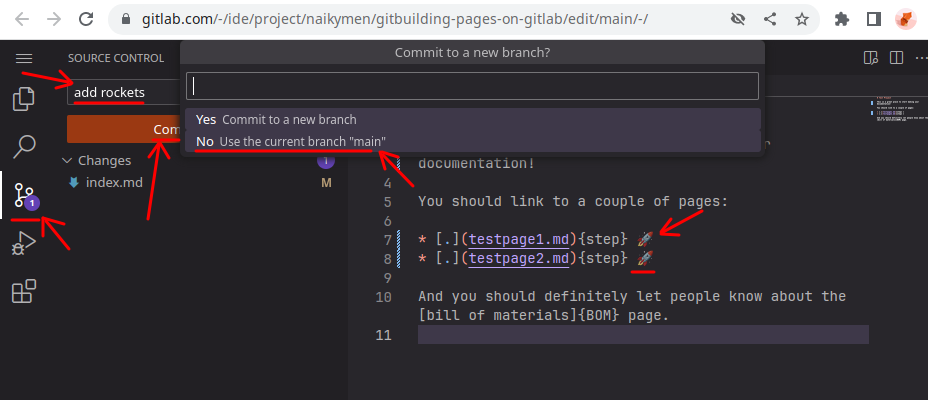
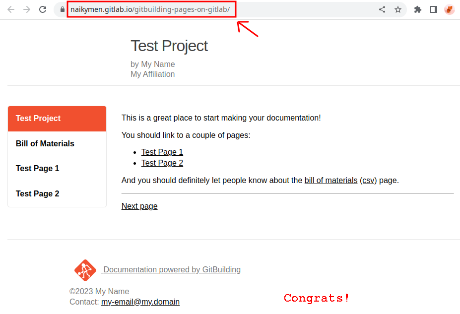
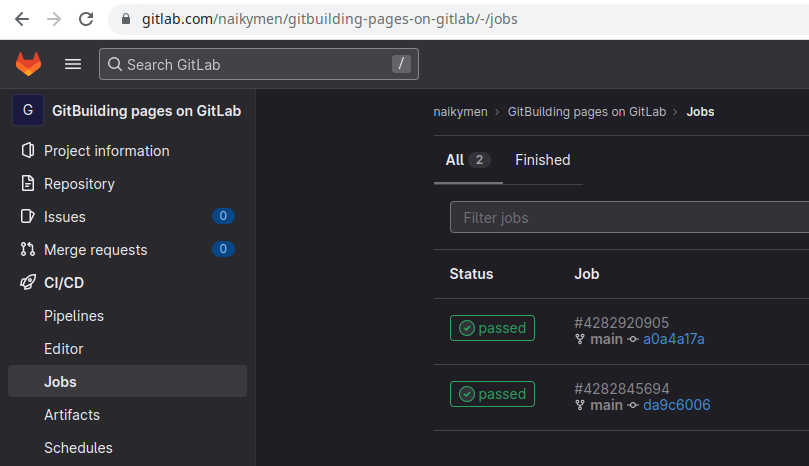

# Deploy a GitBuilding Website

Prerequisites:

- Your GitBuilding documentation project.
- GitLab account.

## Creating a new repository on GitLab

1. Sign-up and/or log-in to GitLab; either at [gitlab.com](https://gitlab.com/) or your instance.

> GitLab is open source :)

2. Go to [gitlab.com/projects/new](https://gitlab.com/projects/new) and create a new blank project.

> The project creates a git repository, where you will store the documentation files for your GitBuilding website, and track changes over time.

3. Configure the new project's details:
    - Choose a name (and "slug").
    - Set the visibility to public.
    - Uncheck the "initialize with README" tick box.
    - Click on create when you are ready.

> Choose a nice, short, descriptive name related to _your_ project. But don't worry too much, these details can be updated later on.

> As a result, you will be taken to the webpage of your your new GitLab project.

4. Save the following information:
  - The project's address, as it appears on your browser's top bar (e.g. `https://gitlab.com/naikymen/gitbuilding-pages-on-gitlab`).
  - You can save time by clicking on "Add README", which will open GitLab's Web IDE (used in step 7 to upload files).

<!--   - The name of the project's primary branch (e.g. `main` as shown in the image below). -->

## Deploying a GitBuilding website on GitLab

5. Now browse to your project's documentation, and open the `.gitlab-ci.yml` file, for editing.

> The file should have been created automatically when you executed the `gitbuilding generate ci` command on a terminal/shell, by choosing the `1. Gitlab Pages` option.
> If you're not familiar with this step, you can create the file instead, and copy-paste the contents from the [example file](https://gitlab.com/gitbuilding/gitbuilding-example/-/blob/master/.gitlab-ci.yml) (shown below).

6. Edit the name of the branch replacing it with the name of your repo's branch.
    - On GitLab the default name is `main` (as shown in the image above).

> This will let GitBuilding know which branch of your git repository stores documentation files that will be published. In this way, you can work on other branches and only update the live docs when ready.

7. Upload your documentation files to your GitLab repo:
    - Bring up your web browser, and open your GitLab project's webpage.
    - Click on "Add README" to open GitLab's web IDE.
    - Drag and drop your project's files onto the left side-panel (first image below).
  

8. Commit and Push your files:
    - Click on the "Source Control" icon on the left side-panel.
    - Write a descriptive commit message (e.g. `added documentation files`).
    - Click on "Commit & Push", and click to save changes to the current "main" branch when prompted.

9. Go back to your GitLab project's main site (_you saved it during step 4_) and notice that:
    - (a) Your files are there, yay!
    - (b) There is a small pacman-like icon. This means that GitLab is deploying your documentation to GitLab pages. Double yay!

10. Find the URL of the newly published GitBuilding documentation.
    - Go to "Pages" settings, under the "Deployments" item in the left side-panel.
    - The URL will appear listed on that page. You can click on it **now** to have a look. :D

## Customizing GitBuilding website

11. Update your documentation modifying Markdown files. Let’s try adding a rocket emoji on the main page!
    - Browse back to the main repo's page, and click on "Web IDE" to open the web editor.
    - Locate the "index.md" file on the left side-panel, and double click on it.
    - Add rocket emojis everywhere: 🚀
    - Click on the "Source Control" icon on the left side-panel.
    - Write a descriptive commit message (e.g. `added documentation files`).
    - Click on "Commit & Push", and choose to use the current "main" branch.

12. Wait for a minute, bring up the browser tab with the online docs, refresh the page, and behold (or wait for a bit more and refresh).

You can check on the status of the "pages jobs" that run after each commit, under the CI/CD menu of your GitLab project. If anything went wrong, it will probably show up there.

Resources for this tutorial:
- GitLab project and repository: https://gitlab.com/naikymen/gitbuilding-pages-on-gitlab
- Published GitBuilding website: https://gitlab.com/naikymen/gitbuilding-pages-on-gitlab
